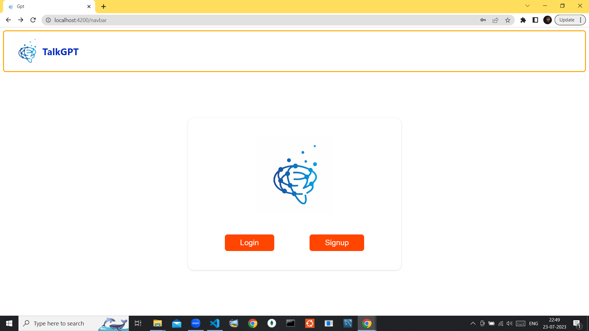
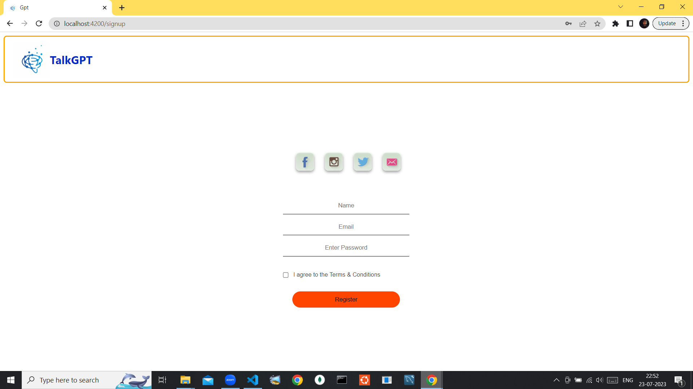
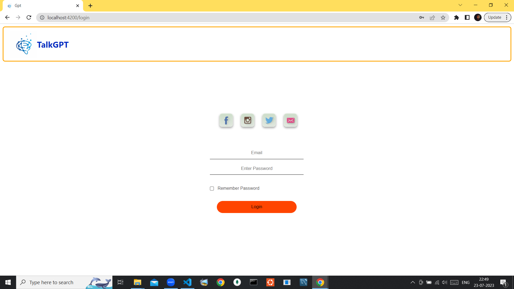
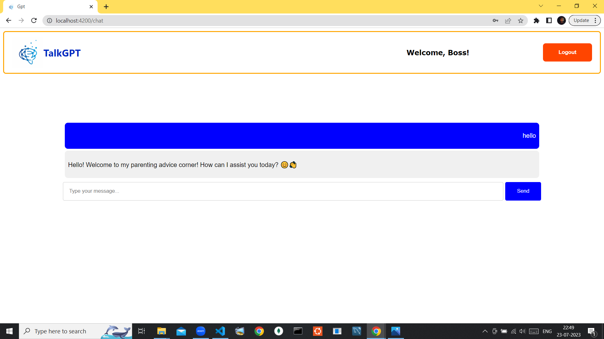

# TalkGPT

## Introduction

TalkGPT is an artificial intelligence chatbot that leverages the power of ChatGPT to provide users with accurate answers to their queries.

## Deplolyed App

- `Frontend link` : https://lovely-empanada-9d490b.netlify.app/navbar
- `Backend link` : https://talkgpt-jddq.onrender.com

## Video Walkthrough of the project

## Pages & Features 👇

- `Home Page`: Navigation bar, a section which containg logo of the Application and LOGIN & SIGNUP button.
- `Sign-Up`: User details are stored in MongoDB Atlas, shows a pop-up if Email has already been used.
- `Log-In`: User authentication to check whether the user's Email and Password match with details existing in the database or not.
  `User's Profile`: Only if the user has been successfully Login, then their name will be shown on the Navigation bar.
  `Chat-Page`: Only after user successfully logged in, then user will be redirected to Chat page and on the Navigation bar a Logout button will be there.
  `Chat-History`: After verification of user, their previous chat will be there on the chat box for every individual users.

## Installation & Getting started

Detailed instructions on how to install, configure, and get the project running:

```bash
`To install npm package manager for Angular`: npm install -g @angular/cli
`To start the application`: ng serve
```

## Usage

```bash
`To start the application`: ng serve
```

## API Endpoints

- POST /api/register - To register the user.
- POST /api/login - To login the user.
- GET /api/getchat - To fetch all the previous chat.

## Technology Stack

- Angular
- Python
- Flask
- MongoDB Atlas

## A little glimpse of the pages 🖼️

- Homepage

  

- Registration Page

  

- Login Page

  

- Chat Page

  

Thanks you for Checking my Project🙏🏻😇
